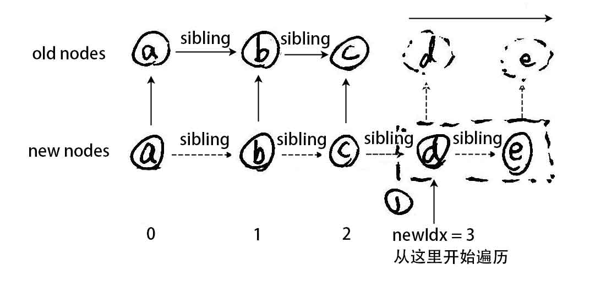
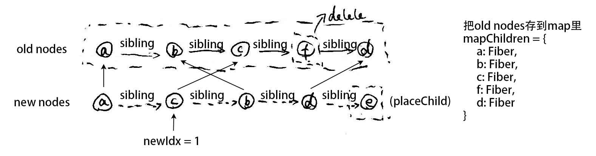

## React

1. <a href="#process">执行过程</a>
2. <a href="#double-cache">双缓冲机制</a>
3. <a href="#diff">diff 算法</a>
4. <a href="#react-redux">React Redux</a>
5. <a href="#redux-saga">Redux Saga</a>

## <a name='process'>执行过程

**准备阶段**

1. beginWork


beginWork(绿色)/completeWork(蓝色) 遍历规则

```javascript
ReactDOM {
  .render() {
    ReactDOMLegacy {
      .render() {
        LegacyRenderSubtreeIntoContainer() {
          ReactFiberReconciler {
            .updateContainer() {
              ReactFiberWorkLoop{
                .scheduleUpdateOnFiber() {
                  // 创建rootFiber，即render方法中的container
                  .markUpdateLaneFromFiberToRoot();
                  .ensureRootIsScheduled() {
                    // 使用该方法将任务按时间切片执行
                    .scheduleCallback(.performConcurrentWorkOnRoot());
                  }
                }
              }
            }
          }
        }
      }
    }
  }
}

.performConcurrentWorkOnRoot() {
  // 创建workInProgress（或用旧的workInProgress）
  .prepareFreshStack();
  .workLoopConcurrent() {
    // 利用双缓冲机制，构造新的fiber tree
    // 利用时间切片，此过程可中断
    // 遍历fiber tree
    while(workInProgress !== null && !shouldYield()) {
      .performUnitOfWork();
    }
  }
}

```

**reconcile（协调）阶段**

```javascript
.performUnitOfWork() {
  next = beginWOrk() {
    // 遍历fiber tree：先儿子，后弟弟，再叔叔
    ReactFiberBeginWork {
      .beginWork() {
        switch(workInProgress.tag) {
          case HostRoot: // root fiber
            // ...
          case HostComponent: // 源生DOM节点
            // ...
          case ClassComponent: // class组件
            // 构造实例 createInstance -> constructor -> componentWillMount/componentWillUpdate
            return updateClassComponent() {
              // 再遍历子组件
              .reconcileChildren();
            }
          case FunctionComponent: // function组件
            return updateFunctionComponent() {
              // 每次执行时记录当前hook到全局变量
              ReactFiberHooks {
                .renderWithHooks() {
                  ReactCurrentDispatcher.current = HooksDispatcherOnMount or HooksDispatcherOnUpdate;
                }
                // 把虚拟DOM转成Fiber节点，生成deletions，节点对比复用，更新fiber.alternate, fiber.flags
                .rendercileChildren();
              }
            }
        }
      }
    }
  }
  // 如果已经遍历完成
  if(next == null) {
    // 得到最后一个fiber，即unitOfWork，执行完成操作
    .completeUnitOfWork();
  } else {
    // 继续遍历
    workInProgress = next;
  }
}
```

1. completeWork

```javascript
.completeUnitOfWork(unitOfWork) {
  let completeWork = unitOfWork;
  do {
    const returnFiber = completedWork.return;
    if(...) {
      let next;
      next = completeWork();
      if(next !== null) {
        workInProgress = next;
        return
      }
    }
    const siblingFiber = completedWork.sibling;
    if(siblingFiber !== null) {
      workInProgress = siblingFiber;
      return;
    }
    completedWork = returnFiber;
    workInProgress = completedWork;
  }while(completedWork !== null);
}

ReactFiberCompleteWork {
  .completeWork() {
    switch (workInProgress.tag) {
      case FunctionComponent:
      case ClassComponent:
      case ...:
        .bubbleProperties(); // 手机effects到fiber.subtreeflags
      case HostComponent:
        .updateHostComponent() {
          ReactDOMHostConfig {
            .prepareUpdate() {
              .diffProperties(); // 对比源生DOM属性
            }
          }
        }
    }
  }
}
```

**commit（提交）阶段**

```javascript
.performConcurrentWorkOnRoot() {
  .renderRootConcurrent();
  .finishConcurrentRender() {
    .commitRoot() { // 传入root fiber，从root fiber开始遍历
      commitImpl() {
        // 根据 subtreeflags 判断是否有更新
        let subtreeHasEffects;
        //保存前一次的数据：getSnapshotBeforeUpdate
        .commitBeforeMutationEffects() {
          .commitBeforeMutationEffectDeletions();
          .commitBeforeMutationEffects();
        }
        .commitMutationEffects() {
          // 把deletions收集到第1个节点，只需要遍历child即可
          .commitEffectsDeletions(fiber.deletions) {
            .componentWillUnmount(); // fiber.deletion 属性保留
            .commitNestedUnmounts() {
              .commitDeletion(); // 执行DOM删除，instance.removeChild
            }
          }
          .commitMutationEffectsImpl() {
            switch(fiber.flags) {
              case Placement:
                .comitPlacement();
              case PlacementAnUpdate:
                .commitPlacement();
                .commitWork();
              case Update:
                commitWork();
            }
          }
        }
        .commitLayoutEffects() {
          .commitLifeCycles() {
            switch(fiber.tag) {
              case FunctionComponent:
                .commitHookEffectListMount();
              case ClassComponent:
                // ...
                .instance.componentDidMount();
                // or
                .instance.componentDidUpdate();
            }
          }
        }
      }
    }
  }
}

ReactFiberCommitWork {
  // flags: Placement
  .commitPlacement() {
    .insertOrAppendPlacementNode() {
      .insertBefore();
      .appendChild();
    }
  }
  // flags: Update
  .commitWOrk() {
    switch(finishWork.tag) {
      case FunctionComponent:
        // 如果是 function 组件, Unmount，清空deletions
        .commitHookEffectListUnmount() {
          .safelyCallDestory();
        }
      case HostComponent:
        // 如果是DOM元素
        .commitUpdate(oldProps = current.memoizedProps, newProps = finishWork.memoizedProps) {
          // 设置新属性并提交到DOM元素
          .updateDOMProperties() {
            .setValueForStyles();
            .setInnerHTML();
            .setValueForProperty() {
              // 用正则表达式判断属性名是否合法
              if(isAttributeNameSafe(name)) {
                node.removeAttribute();
                // or
                node.setAttribute();
              }
            }
          }
        }
    }
  }
}
```

## <a name='double-cache'>双缓冲机制


双缓冲根 Fiber，reconcileChildren 阶段

## <a name='diff'>diff 算法

主要是 reconcileChildren -> reconcileChildrenArray()的遍历

1. 第一遍历新数组，新老数组 index 进行对比，通过 updateSlot 方法找到可以复用的节点，直到找到不可复用的节点就退出循环


1. 第一遍历完之后，删除剩余的老节点，追加剩余的新节点的过程。如果是新节点已遍历完成，就将剩余的老节点批量删除。
2. 如果是老节点遍历完成仍有新节点剩余，则将新节点插入。



4. 把所有老数组元素按 key 或 index 放 Map 里，然后遍历新数组，插入老数组的元素，这是移动的情况。



## <a name='react-redux'>React Redux

**安装相关依赖**

1. <code>yarn add redux</code>
2. <code>yarn add react-redux</code>

**构建 store 和 reducer**

1. 创建 reducer/index.js 文件，构建 reducer 来相应 actions
2. 创建 store/index.js 文件，通过 createStore 方法，把我们的 reducer 传入进来
3. 在 app.js 中引入 store

**搭建页面结构**

1. 创建一个组件，名字叫 CompA，里面放一个 button 按钮
2. 创建另一个组件，名字叫 CompB，里面放一个 div，用来显示数字
3. 在 app.js 中引入两个组件

**Provider 组件实现**

1. 引入 Provider 组件，在 react-redux 中进行导入
2. 需要利用 Provider 对我们的整个结构进行包裹
3. 给我们的 Provider 组件传入 Store 属性，而这个值就是我们通过 createStore 构建出来的 store 实例对象

**CompA 发送 action**

1. 导入 connect
2. 利用 connect 对组件进行加强
   - connect(mapStateToProps, mapDispatchToProps)(Component);
   - mapStateToProps: 需要接收数据的函数
   - mapDispatchToProps: 要发送 action 的函数
3. 我们需要实现 connect 第二个参数
4. 构建一个函数 mapDispatchToProps(dispatch)
   - dispatch: 就是用来发送 action 的
5. 在这个函数里面就可以返回一个对象
   key: 方法名
   value: 调用 dispatch 去发送 action
6. 在组件的内部就可以通过 this.props 来拿到这个方法了

**CompB 接收 state**

1. 导入 connect 方法
2. 利用 connect 对组件进行加强
3. CompB 属于接收方，就需要实现 connect 的第一个参数
4. mapStateToProps 里面的一个参数就是我们关心的 state
5. 把这个 state 进行 return 才能在组件内部获取到最新的数据
6. CompB 能否拿到数据，关键是 reducer
7. 只有 reducer 里面返回了新的 state 的时候，我们才能够获取到

## <a name='redux-saga'>Redux Saga

**关联 store**

1. 在 redux 里面导入 applyMiddleware
2. 导入 createSagaMiddleware
3. 导入自己创建的 saga
4. 调用 createSagaMiddleware 方法，返回 middleware 实例对象
   - <code>const sagaMiddleware = createSagaMiddleware()</code>
5. 通过 createStore 第三个参数进行关联
   - <code>createStore(defReducer, {}, applyMiddleware(sagaMiddleware))</code>
6. 运行 saga，通过<code>sagaMiddleware.run(自己定义的 saga)</code>

**Saga 辅助函数**

1. takeEvery(pattern, saga, ...args);
   - 触发了多少次，就执行多少次任务
2. takeLatest(pattern, saga, ...args);
   - 每次触发，会取消上一次正在执行的异步任务
3. throttle(ms, pattern, saga, ...args);
   - 匹配到一个对应的 action 后，会执行一个异步任务，但是同时还会接收一次对应的 action 异步任务，放在底层的 buffer 中，那么在第一个参数 ms 毫秒内将不会执行异步任务了。

**Effect 创建器**

1. select(selector);
   - select(select, ...args) 获取 redux 中的 state，如果调用 select 的参数为空（即 yield select()），那么 effect 会取得完整的 state（与调用 getState()）结果相同
2. call(fn, ...args);
   - 创建一个 Effect 描述信息，用来命令 middleware 以参数 args 调用 fn
3. fork(fn, ...args);
4. - 创建一个 Effect 描述信息，用来命令 middleware 以非阻塞调用的形式执行 fn
5. take(pattern)
   - 阻塞的方法，用来匹配发出的 action
6. put(action)
   - 用来命令 middleware 向 Store 发起一个 action。这个 effect 是非阻塞的。

**Effect 组合器**
1. race(effects)
   - 创建一个 Effect 描述信息，用来命令 middleware 在多个 Effect 间运行竞赛（Race），其中一个完成后，那么另外一个 Effect默认被取消
2. all([...effects])
   - 创建一个 Effect描述信息，用来命令 middleware 并行地运行多个 Effect，并等待它们全部完成
