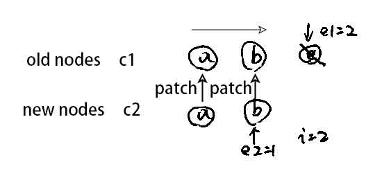

## Vue

1. <a href="#vue2.0">Vue 2.0 数据劫持</a>
2. <a href="#vue3.0">Vue 3.0 数据劫持</a>
3. <a href="#diff">diff 算法</a>

## <a name='vue2.0'>Vue 2.0 数据劫持

```javascript
let oldArrayPrototype = Array.prototype;
let proto = Object.create(oldArrayPrototype); // 继承
["push", "shift", "unshift"].forEach((method) => {
  // 函数劫持，把函数进行重写，内部继续调用老的方法
  proto[method] = function () {
    updateView();
    oldArrayPrototype[method].call(this, ...arguments);
  };
});
function observer(target) {
  if (typeof target !== "object" || target == null) {
    return target;
  }
  if (Array.isArray(target)) {
    // 拦截数组，给数组的方法进行重写
    Object.setPrototypeOf(target.prototype);
  }
  for (let key in target) {
    defineReactive(target, key, target[key]);
  }
}

function defineReactive(target, key, value) {
  observer(value); // 递归
  Object.defineProperty(target, key, {
    get() {
      // get中进行依赖收集
      return value;
    },
    set(newValue) {
      if (newValue !== value) {
        observer(newValue);
        updateView();
        value = newValue;
      }
    },
  });
}
```

## <a name='vue3.0'>Vue 3.0 数据劫持

- Vue 2.0 的问题

  1. 创建对象默认会将所有属性递归一遍;
  2. 数组一些方法非响应式，如 length;
  3. 对象不存在的属性不能被拦截

- 使用 Proxy 的缺点

  兼容性插，IE11 不兼容

```javascript
const obj = { name: "zf" }; //响应式对象
console.log(obj.name); //  -> 触发get -> track -> 存入effect
obj.name = "jw"; // -> 触发set -> trigger -> 从effect中取出来执行
```

```javascript
let obj = Vue.reactive({ name: "zf" });
Vue.effect(() => {
  // effect会执行两次，默认执行一次，之后依赖改变再执行
  console.log(obj.name);
});
```

**Proxy 订阅者模式**

```javascript
export function reactive(target) {
  return createReactiveObject(target, baseHandler);
}

function createReactiveObject(target, baseHandler) {
  if (!isObject(target)) {
    return target;
  }
  const observed = new Proxy(target, baseHandler);
  return observed;
}
function createGetter() {
  return function get(target, key, receiver) {
    const res = Reflect.get(target, key, receiver); // target[key];
    track(target, "get", key); // 收集依赖
    if (isObject(res)) {
      // 如 obj = reactive({name: 1, arr: [1,2,3]})
      // obj.arr.push(4);
      // 子对象如果是对象则需要再次递归proxy
      reactive(res);
    }
    return res;
  };
}

function createSetter() {
  return function set(target, key, value, receiver) {
    const hadKey = hasOwn(target, key); // 判断是否已经收集过此依赖
    const oldValue = target[key];
    const result = Reflect.set(target, key, value, receiver);
    if (!hadKey) {
      trigger(target, "add", key, value);
    } else if (hasChanged(value, oldValue)) {
      trigger(target, "set", key, value);
    }
    return result;
  };
}

export function effect(fn, options = {}) {
  const effect = createReactiveEffect(fn, options);
  if (!options.lazy) {
    effect();
  }
  return effect;
}
```

**WeakMap 依赖收集结构**

| key (any)               | value (Map)                                           |
| :---------------------- | :---------------------------------------------------- |
| { name: 'zf', age: 11 } | { name: Set { effect, effect }, age: Set { effect } } |
| { name: 'jw', age: 28 } | { name: Set { effect, effect }, age: Set { effect } } |

```javascript
// 收集依赖
effect(() => {
  state.name;
});
state.name = "jw";

// 1. 执行effect， 将当前effect赋予activeEffect
// 2. 如果函数里调用了getter方法，则进行依赖收集（track） -> 进 WeakMap
// 3. 更改变量，调用setter方法，则进行触发方法（trigger）
```

## <a name='diff'>diff 算法

代码目录：/pakages/runtime-core/src/renderer.ts

### 无 key 情况下

#### 1. 无 key 情况下，取长度值最小的一组做 patch


### 有 key 情况下（混含情况，有的有 key，有的没有 key）

#### 1. 从头部开始比对, <code>i <= e1 && i <= e2</code>


#### 2. 从尾部开始比较，<code>i < e1 && i <= e2</code>


#### 3. common sequence + mount（同序列加挂载，新节点比旧节点多），<code>if(i > e1 && i <= e2)</code>

当前情况，表示子节点要么头部是有序的，要么是尾部是有序的，且新节点比旧节点多的情况

```javascript
/*
头部有序
c1 : (a b)
        ^
        e1
c2 : (a b) c
           ^
          i,e2
i = 2, e1 = 1, e2 = 2
*/
```


```javascript
/*
尾部有序
c1 :   (a, b)
     ^
     e1
c2 : c (a  b)
     ^
    i,e2
i = 0, e1 = -1, e2 = 0
*/
```


#### 4. common sequence + unmount（老节点比新节点多），<code>else if(i > e2 && i <= e1)</code>

当前情况，表示子节点要么头部是有序的，要么是尾部是有序的，且旧节点比新节点多的情况

```javascript
/*
头部有序
c1: (a b) c
          ^
         i,e1
c2: (a b)
       ^
       e2
i = 2, e1 = 2, e2 = 1
*/
```



```javascript
/*
尾部有序
c1: a (b c)
    ^
   i,e1
c2:   (b c)
    ^
    e2
i = 0, e1 = 0, e2 = -1
*/
```


#### 5. unknown sequence（未知序列）,<code>else</code>

该情况表示头部有序，且尾部有序，中间区域未知的情况。

该情况主要解决中间区域尽可能复用的问题。

```javascript
/*
情况一：
c1 : a b [c d e]   f g
          ^   ^
        i,s1  e1
c2 : a b [e d c h] f g
          ^     ^
        i,s2    e2
确定了乱序区域：
旧节点: [s1, e1]
新节点: [s2, e2]
*/
```


```javascript
/*
情况二：
c1 : a b [c d e] f g
          ^   ^
        i,s1  e1
c2 : a b         f g
       ^  ^
       e2 i,s2
确定乱序区域
旧节点: [s1, e1]
新节点: [s2, e2](空)
*/
```


```javascript
/*
情况三：
c1 : a b [c d e q] f g
          ^     ^
         i,s1   e1
c2 : a b [e c d h] f g
          ^     ^
         i,s2   e2
确定乱序区域
旧节点：[s1, e1]
新节点：[s2, e2]
*/
```


```javascript
/*
c1: c d e q
    ^ ^ ^ ^
    2 3 4 5
c2: e c d h
    ^ ^ ^ ^
    2 3 4 5
s1 = 2, e1 = 5
s2 = 2, e2 = 5
1. keyToNewIndexMap = new Map(){[e,2],[c,3],[d,4],[h,5]} 将所有新节点存到map中

2. 
toBePatched = e2 - s2 + 1 = 4
newIndexToOldIndexMap: [0, 0, 0, 0]

3. 遍历旧节点 i = s1; i <= e1; i++
*****************
当 i = 2：
c1[i] = c节点
newIndex = keyToNewIndexMap.get(c节点.key) = 3
newIndexToOldIndexMap[newIndex - s2] = i + 1
即 newIndexToOldIndexMap[1] = 3

result:
newIndexToOldIndexMap = [0, 3, 0, 0]

****************
当 i = 3：
c1[i] = d节点
newIndex = keyToNewIndexMap.get(d节点.key) = 4
newIndexToOldIndexMap[newIndex - s2] = i + 1
即 newIndexToOldIndexMap[2] = 4

result:
newIndexToOldIndexMap = [0, 3, 4, 0]

****************
当i = 4：
c1[i] = e节点
newIndex = keyToNewIndexMap.get(e节点.key) = 2
newIndexToOldIndexMap[newIndex - s2] = i + 1
即 newIndexToOldIndexMap[0] = 5

result:
newIndexToOldIndexMap = [5, 3, 4, 0]

当i = 5：
c1[i] = q节点
newIndex = keyToNewIndexMap.get(q节点.key) = undefined
删除q节点
*/
```


在头尾对比后，中间未知序列尽可能复用

- 复用流程：
  1. keyToNewIndexMap = new Map()
     - 将所有新节点的存起来 key 为节点的 key 值，value 为节点的下标[node.key, index]
  2. newIndexToOldIndexMap[0, 0, 0, 0]
     - newIndexToOldIndexMap = new Array(toBePatched)
     - toBePatched = e2 - s2 + 1 = 4
  3. 遍历旧节点
  4. ① 找到不能复用的节点并删除
  5. ② ③ ④ 将能复用的节点下标记录到 newIndexToOldIndexMap 中
  6. ⑤ 移动节点位置 -> 利用 getSequence 最长递增子节点算法
     - [2, 3, 4, 1] -> [2, 3, 4]
  7. ⑥ 将新节点插入

```javascript
// 最长递增子节点
// https://en.wikipedia.org/wiki/Longest_increasing_subsequence
function getSequence(arr: number[]): number[] {
  const p = arr.slice();
  const result = [0];
  let i, j, u, v, c;
  const len = arr.length;
  for (i = 0; i < len; i++) {
    const arrI = arr[i];
    if (arrI !== 0) {
      j = result[result.length - 1];
      if (arr[j] < arrI) {
        p[i] = j;
        result.push(i);
        continue;
      }
      u = 0;
      v = result.length - 1;
      while (u < v) {
        c = ((u + v) / 2) | 0;
        if (arr[result[c]] < arrI) {
          u = c + 1;
        } else {
          v = c;
        }
      }
      if (arrI < arr[result[u]]) {
        if (u > 0) {
          p[i] = result[u - 1];
        }
        result[u] = i;
      }
    }
  }
  u = result.length;
  v = result[u - 1];
  while (u-- > 0) {
    result[u] = v;
    v = p[v];
  }
  return result;
}
```
