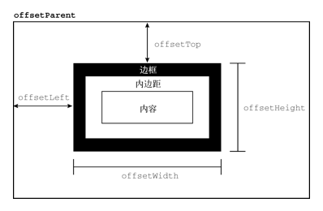
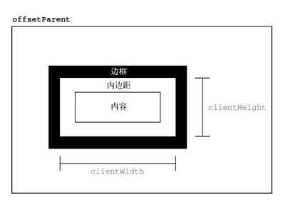
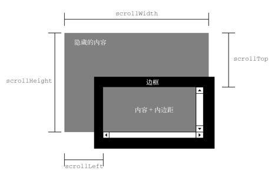
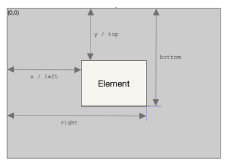

# DOM

## 索引

1. <a href="#pixel-size">元素尺寸

## <a name="pixel-size">元素尺寸

### 1. 偏移尺寸

第一组属性涉及偏移尺寸（offset dimensions），包含元素在屏幕上占用的所有视觉空间。元素在页面上的视觉空间由其高度和宽度决定，包括所有内边距、滚动条和边框（但不包含外边距）。以下 4 个属性用于取得元素的偏移尺寸。

- offsetHeight，元素在垂直方向上占用的像素尺寸，包括它的高度、水平滚动条高度（如果可见）和上、下边框的高度。
- offsetLeft，元素左边框外侧距离包含元素左边框内侧的像素数。
- offsetTop，元素上边框外侧距离包含元素上边框内侧的像素数。
- offsetWidth，元素在水平方向上占用的像素尺寸，包括它的宽度、垂直滚动条宽度（如果可见）和左、右边框的宽度。

其中，offsetLeft 和 offsetTop 是相对于包含元素的，包含元素保存在 offsetParent 属性中。offsetParent 不一定是 parentNode。比如，\<td>元素的 offsetParent 是作为其祖先的\<table>元素，因为\<table>是节点层级中第一个提供尺寸的元素。图 161 展示了这些属性代表的不同尺寸。

### 2. 客户端尺寸

元素的客户端尺寸（client dimensions）包含元素内容及其内边距所占用的空间。客户端尺寸只有两个相关属性：clientWidth 和 clientHeight。其中，clientWidth 是内容区宽度加左、右内边距宽度，clientHeight 是内容区高度加上、下内边距高度。图 162 形象地展示了这两个属性。

客户端尺寸实际上就是元素内部的空间，因此不包含滚动条占用的空间。这两个属性最常用于确定浏览器视口尺寸，即检测 document.documentElement 的 clientWidth 和 clientHeight。这两个属性表示视口（\<html>或\<body>元素）的尺寸。

### 3. 滚动尺寸

最后一组尺寸是滚动尺寸（scrolldimensions），提供了元素内容滚动距离的信息。有些元素，比如\<html>无须任何代码就可以自动滚动，而其他元素则需要使用 CSS 的 overflow 属性令其滚动。滚动尺寸相关的属性有如下 4 个。

- scrollHeight，没有滚动条出现时，元素内容的总高度。
- scrollLeft，内容区左侧隐藏的像素数，设置这个属性可以改变元素的滚动位置。
- scrollTop，内容区顶部隐藏的像素数，设置这个属性可以改变元素的滚动位置。
- scrollWidth，没有滚动条出现时，元素内容的总宽度。

scrollWidth 和 scrollHeight 可以用来确定给定元素内容的实际尺寸。例如，\<html>元素是浏览器中滚动视口的元素。因此，document.documentElement.scrollHeight 就是整个页面垂直方向的总高度。

scrollWidth 和 scrollHeight 与 clientWidth 和 clientHeight 之间的关系在不需要滚动的文档上是分不清的。如果文档尺寸超过视口尺寸，则在所有主流浏览器中这两对属性都不相等，scrollWidth 和 scollHeight 等于文档内容的宽度，而 clientWidth 和 clientHeight 等于视口的大小。

### 4. 确定元素尺寸

浏览器在每个元素上都暴露了 getBoundingClientRect()方法，返回一个 DOMRect 对象，包含 6 个属性：left、top、right、bottom、height 和 width。这些属性给出了元素在页面中相对于视口的位置。图 1642 展示了这些属性的含义。

