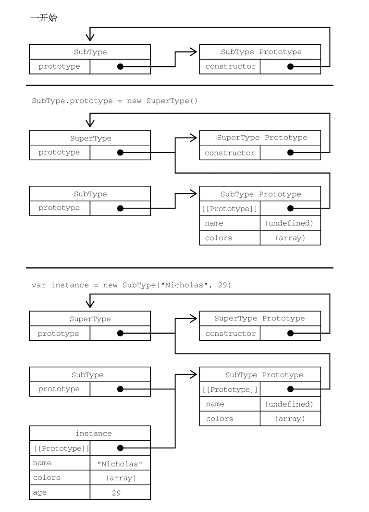

## 对象

**索引**

1. <a href="#inherit">对象的继承</a>
2. <a href="#attribute-type">属性的类型</a>

## <a name='inherit'>对象的继承

**各继承方式总结**

1. 组合继承：原型链继承（继承原型属性和方法） + 盗用构造函数继承（继承属性）

2. 原型式继承：创建一个实现继承的函数，然后返回这个对象

   object()和 Object.create()函数内部实现是创建一个新对象，让这个对象的原型指向父对象；

3. 寄生式继承：创建一个实现继承的函数，以某种方式增强对象，然后返回这个对象；

4. 组合寄生式继承：寄生式继承（浅复制原型属性和方法） + 盗用构造函数继承（继承属性）

**原型链的问题**
原型链虽然是实现继承的强大工具，但它也有问题。主要问题出现在原型中包含引用值的时候。前面在谈到原型的问题时也提到过，原型中包含的引用值会在所有实例间共享，这也是为什么属性通常会在构造函数中定义而不会定义在原型上的原因。在使用原型实现继承时，原型实际上变成了另一个类型的实例。这意味着原先的实例属性摇身一变成为了原型属性。下面的例子揭示了这个问题：

```javascript
function SuperType() {
  this.colors = ["red", "blue", "green"];
}

function SubType() {}

//继承
SubType.prototype = new SuperType();

let instance1 = new SubType();
instance.colors.push("black");
console.log(instance1.colors); // "red,blue,green,black"
let instance2 = new SubType();
console.log(instance2.colors); // "red,blue,green,black"
```

### 组合继承

组合继承（有时候也叫伪经典继承）综合了原型链和盗用构造函数，将两者的优点集中了起来。基本的思路是使用原型链继承原型上的属性和方法，而通过盗用构造函数继承实例属性。这样既可以把方法定义在原型上以实现重用，又可以让每个实例都有自己的属性。来看下面的例子：

```javascript
function SuperType(name) {
  this.name = name;
  this.colors = ["red", "blue", "green"];
}

SuperType.prototype.sayName = function () {
  console.log(this.name);
};

function SubType(name, age) {
  // 盗用构造函数，继承属性，第二次调用SuperType
  SuperType.call(this, name);

  this.age = age;
}

// 继承属性和方法,第一次调用SuperType
SubType.prototype = new SuperType();

SubType.prototype.constructor = SubType;

SubType.prototype.sayAge = function () {
  console.log(this.age);
};

let instance1 = new SubType("Nicholas", 29);
instance1.colors.push("black");
console.log(instance1.colors); // "red,blue,green,black"
instance1.sayName(); // "Nicholas"
instance1.sayAge(); // 29
let instance2 = new SubType("Greg", 27);
console.log(instance2.colors);
instance2.sayName(); // "Greg"
instance2.sayAge(); // 27
```

**特点**

- 最主要的效率问题就是父类构造函数始终会被调用两次：
  - 一次在是创建子类原型时调用(<code>SubType.prototype = new SuperType();</code>)
  - 另一次是在子类构造函数中调用(<code>SuperType.call(this);</code>)



### 原型式继承

原型式继承适用于这种情况：你有一个对象，想在它的基础上再创建一个新对象。你需要把这个对象先传给 object()，然后再对返回的对象进行适当修改。在这个例子中，person 对象定义了另一个对象也应该共享的信息，把它传给 object()之后会返回一个新对象。这个新对象的原型是 person，意味着它的原型上既有原始值属性又有引用值属性。

```javascript
function object(o) {
  function F() {}
  F.prototype = o;
  return new F();
}

let person = {
  name: "Nicholas",
  friends: ["Shelly", "Court", "Van"],
};

// 等价 let anotherPerson = object(person);
let anotherPerson = Object.create(person);
anotherPerson.name = "Greg";
anotherPerson.friends.push("Rob");

// 等价 let yetAnotherPerson = object(person);
let yetAnotherPerson = Object.create(person);
yetAnotherPerson.name = "Linda";
yetAnotherPerson.friend.push("Barbie");

console.log(person.friends); // "Shelly,Court,Van,Rob,Barbie"
```

**特点**
属性中包含的引用值始终会在相关对象间共享，跟使用原型模式是一样的。

### 寄生式继承

与原型式继承比较接近的一种继承方式是寄生式继承。寄生式继承背后的思路类似于寄生构造函数和工厂模式：创建一个实现继承的函数，以某种方式增强对象，然后返回这个对象。基本的寄生继承模式如下：

```javascript
function createAnother(original) {
  // 等价 let clone = object(original);
  let clone = Object.create(original);
  clone.sayHi = function () {
    console.log("hi");
  };
  return clone;
}

let person = {
  name: "Nicholas",
  friends: ["Shelly", "Court", "Van"],
};

let anotherPerson = createAnother(person);
anotherPerson.sayHi(); // "hi"
```

**特点**

通过寄生式继承给对象添加函数会导致函数难以重用，与构造函数模式类似（<code>SubType.prototype = new SuperType()</code>）。

### 寄生式组合继承

寄生式组合继承通过盗用构造函数继承属性，但使用混合式原型链继承方法。基本思路是不通过调用父类构造函数给子类原型赋值，而是取得父类原型的一个副本。说到底就是使用寄生式继承来继承父类原型，然后将返回的新对象赋值给子类原型。

寄生式组合继承的基本模式如下所示：

```javascript
function inheritPrototype(subType, superType) {
  // let prototype = object(superType.prototype);
  let prototype = Object.create(superType.prototype); //创建对象
  prototype.constructor = subType; //增强对象
  subType.prototype = prototype; //赋值对象
}
```

```javascript
function SuperType(name) {
  this.name = name;
  this.colors = ["red", "blue", "green"];
}
SuperType.prototype.sayName = function () {
  console.log(this.name);
};
function SubType(name, age) {
  SuperType.call(this, name);

  this.age = age;
}

// SubType.prototype = inheritPrototype(SuperType);
SubType.prototype = Object.create(SuperType.prototype); // 创建对象（浅复制，并不调用SuperType函数）
SubType.prototype.constructor = SubType; // 增强对象

SubType.prototype.sayAge = function () {
  console.log(this.age);
};
```

**特点**

- 这里只调用了一次 SuperType 构造函数，避免了 SubType.prototype 上不必要也用不到的属性
- 因此可以说这个例子的效率更高。

## <a name="attribute-type">属性类型

属性分两种：**数据属性**和**访问器属性**。

### 1. 数据属性

数据属性包含一个保存数据值的位置。值会从这个位置读取，也会写入到这个位置。数据属性有 4 个特性描述它们的行为。

- [[Configurable]]：表示属性是否可以通过 delete 删除并重新定义，是否可以修改它的特性，以及是否可以把它改为访问器属性。默认情况下，所有直接定义在对象上的属性的这个特性都是 true，如前面的例子所示。

- [[Enumerable]]：表示属性是否可以通过 for in 循环返回。默认情况下，所有直接定义在对象上的属性的这个特性都是 true，如前面的例子所示。

- [[Writable]]：表示属性的值是否可以被修改。默认情况下，所有直接定义在对象上的属性的这个特性都是 true，如前面的例子所示。

- [[Value]]：包含属性实际的值。这就是前面提到的那个读取和写入属性值的位置。这个特性的默认值为 undefined。

要修改属性的默认特性，就必须使用 Object.defineProperty()方法。这个方法接收 3 个参数：要给其添加属性的对象、属性的名称和一个描述符对象。最后一个参数，即描述符对象上的属性可以包含：configurable、enumerable、writable 和 value，跟相关特性的名称一一对应。根据要修改的特性，可以设置其中一个或多个值。比如：

```javascript
let person = {};
Object.defineProperty(person, "name", {
  writable: false,
  value: "Nicholas",
});
console.log(person.name); // "Nicholas"
person.name = "Greg";
console.log(person.name); //"Nicholas"
```

### 2. 访问器属性

访问器属性不包含数据值。相反，它们包含一个获取（getter）函数和一个设置（setter）函数，不过这两个函数不是必需的。在读取访问器属性时，会调用获取函数，这个函数的责任就是返回一个有效的值。在写入访问器属性时，会调用设置函数并传入新值，这个函数必须决定对数据做出什么修改。访问器属性有 4 个特性描述它们的行为。

- [[Configurable]]：表示属性是否可以通过 delete 删除并重新定义，是否可以修改它的特性，以及是否可以把它改为数据属性。默认情况下，所有直接定义在对象上的属性的这个特性都是 true。

- [[Enumerable]]：表示属性是否可以通过 for in 循环返回。默认情况下，所有直接定义在对象上的属性的这个特性都是 true。

- [[Get]]：获取函数，在读取属性时调用。默认值为 undefined。

- [[Set]]：设置函数，在写入属性时调用。默认值为 undefined。

访问器属性是不能直接定义的，必须使用 Object.defineProperty()。下面是一个例子：

```javascript
// 定义一个对象，包含伪私有成员year_和公共成员edition
let book = { year_: 2017, edition: 1 };
Object.defineProperty(book, "year", {
  get() {
    return this.year_;
  },
  set(newValue) {
    if (newValue > 2017) {
      this.year_ = newValue;
      this.edition += newValue2017;
    }
  },
});
book.year = 2018;
console.log(book.edition); //2
```
