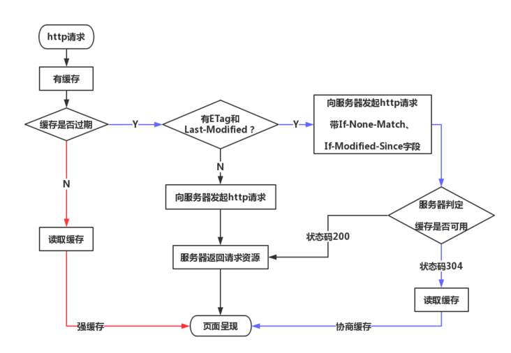

## HTTP

**索引**

1. <a href="#http">http</a>
2. <a href="#compare">http 1.0/1.1/2.0/3.0 区别</a>
3. <a href="#https">https</a>
4. <a href="#同源策略">同源策略</a>
5. <a href="#cors">CORS 请求</a>
6. <a href="#cache">http 缓存</a>

## <a name='compare'>http 1.0/1.1/2.0/3.0 区别

<table>
    <tr>
        <th width="10%">内容</th>
        <th width="20%">1.0</th>
        <th width="30%">1.1</th>
        <th width="40%">2.0</th>
    </tr>
    <tr>
        <td>持久化</td>
        <td>不支持，每次请求都需要建立一条单独的连接，请求完成后立即断开连接</td>
        <td>支持，默认模式使用带流水线的持久连接（Connection: keep-alive），在一个TCP连接上可以传送多个HTTP请求和响应</td>
        <td>支持</td>
    </tr>
    <tr>
        <td>Host请求头</td>
        <td>❌</td>
        <td>增加Host请求头字段后，WEB浏览器可以使用主机头名来明确表示要访问服务器上的哪个WEB站点，这才实现了在一台WEB服务器上可以在同一个IP地址和端口号上使用不同的主机名来创建多个虚拟WEB站点</td>
        <td>✅</td>
    </tr>
    <tr>
        <td>Cache缓存</td>
        <td>主要使用header里的If-Modified-Since,Expires来做为缓存判断的标准</td>
        <td>引入了更多的缓存控制策略例如Entity tag，If-Unmodified-Since, If-Match, If-None-Match等更多可供选择的缓存头来控制缓存策略</td>
        <td>✅</td>
    </tr>
    <tr>
        <td>断点续传</td>
        <td>❌</td>
        <td>✅</td>
        <td>✅</td>
    </tr>
    <tr>
        <td>请求数量限制</td>
        <td>6个左右，如果请求数量较多，则会造成请求阻塞</td>
        <td>6个左右，如果请求数量较多，则会开启多个TCP请求，有可能会造成阻塞</td>
        <td>6个左右，因多路复用的原因，所以同一时间同一域名的请求只会使用1个TCP请求</td>
    </tr>
    <tr>
        <td>请求顺序</td>
        <td>串行处理，每一次请求必须要等待响应结束，才可以发起下一次请求</td>
        <td>串行处理</td>
        <td>并行处理</td>
    </tr>
    <tr>
        <td>多路复用 (Multiplexing)</td>
        <td>❌</td>
        <td>❌</td>
        <td>多路复用允许同时通过单一的 HTTP/2 连接发起多重的请求-响应消息。在 HTTP/1.1 协议中浏览器客户端在同一时间，针对同一域名下的请求有一定数量限制。超过限制数目的请求会被阻塞。这也是为何一些站点会有多个静态资源 CDN 域名的原因之一，拿 Twitter 为例，http://twimg.com，目的就是变相的解决浏览器针对同一域名的请求限制阻塞问题。而 HTTP/2 的多路复用(Multiplexing) 则允许同时通过单一的 HTTP/2 连接发起多重的请求-响应消息。因此 HTTP/2 可以很容易的去实现多流并行而不用依赖建立多个 TCP 连接，HTTP/2 把 HTTP 协议通信的基本单位缩小为一个一个的帧，这些帧对应着逻辑流中的消息。并行地在同一个 TCP 连接上双向交换消息。</td>
    </tr>
    <tr>
        <td>二进制分帧</td>
        <td>❌</td>
        <td>❌</td>
        <td>HTTP/2在 应用层(HTTP/2)和传输层(TCP or UDP)之间增加一个二进制分帧层。在不改动 HTTP/1.x 的语义、方法、状态码、URI 以及首部字段的情况下, 解决了HTTP1.1 的性能限制，改进传输性能，实现低延迟和高吞吐量。在二进制分帧层中， HTTP/2 会将所有传输的信息分割为更小的消息和帧（frame）,并对它们采用二进制格式的编码 ，其中 HTTP1.x 的首部信息会被封装到 HEADER frame，而相应的 Request Body 则封装到 DATA frame 里面。</td>
    </tr>
    <tr>
        <td>首部压缩（Header Compression）</td>
        <td>❌</td>
        <td>❌</td>
        <td>HTTP/1.1并不支持 HTTP 首部压缩，为此 SPDY 和 HTTP/2 应运而生， SPDY 使用的是通用的DEFLATE 算法，而 HTTP/2 则使用了专门为首部压缩而设计的 HPACK 算法。</td>
    </tr>
    <tr>
        <td>服务端推送（Server Push）</td>
        <td>❌</td>
        <td>❌</td>
        <td>服务端推送是一种在客户端请求之前发送数据的机制。在 HTTP/2 中，服务器可以对客户端的一个请求发送多个响应。Server Push 让 HTTP1.x 时代使用内嵌资源的优化手段变得没有意义；如果一个请求是由你的主页发起的，服务器很可能会响应主页内容、logo 以及样式表，因为它知道客户端会用到这些东西。</td>
    </tr>
</table>

## <a name='https'> https

HTTPS 在传输数据之前需要客户端（浏览器）与服务端（网站）之间进行一次握手，在握手过程中将确立双方加密传输数据的密码信息。TLS/SSL 协议不仅仅是一套加密传输的协议，TLS/SSL 中使用了非对称加密，对称加密以及 HASH 算法。握手过程的简单描述如下：

1. 浏览器将自己支持的一套加密规则发送给网站。
2. 网站从中选出一组加密算法与 HASH 算法，并将自己的身份信息以证书的形式发回给浏览器。证书里面包含了网站地址，加密公钥，以及证书的颁发机构等信息。
3. 获得网站证书之后浏览器要做以下工作：
   1. 验证证书的合法性（颁发证书的机构是否合法，证书中包含的网站地址是否与正在访问的地址一致等），如果证书受信任，则浏览器栏里面会显示一个小锁头，否则会给出证书不受信的提示。
   2. 如果证书受信任，或者是用户接受了不受信的证书，浏览器会生成一串随机数的密码，并用证书中提供的公钥加密。
   3. 使用约定好的 HASH 计算握手消息，并使用生成的随机数对消息进行加密，最后将之前生成的所有信息发送给网站。
4. 网站接收浏览器发来的数据之后要做以下的操作：
   1. 使用自己的私钥将信息解密取出密码，使用密码解密浏览器发来的握手消息，并验证 HASH 是否与浏览器发来的一致。
   2. 使用密码加密一段握手消息，发送给浏览器。
5. 浏览器解密并计算握手消息的 HASH，如果与服务端发来的 HASH 一致，此时握手过程结束，之后所有的通信数据将由之前浏览器生成的随机密码并利用对称加密算法进行加密。

默认 HTTP 的端口号为 80，HTTPS 的端口号为 443。

## <a name='同源策略'> 同源策略

- 协议相同
- 域名相同
- 端口号相同

限制：

- 无法读取非同源网页的 Cookie, LocalStorage 和 IndexedDB
- 无法接触非同源网页的 DOM
- 无法向非同源地址发送 ajax 请求（可以发送，但浏览器会拒绝接受响应）

**规避同源策略**

同源策略规定，ajax 请求只能发给同源的网址，否则就报错，除了架设服务器代理（浏览器请求同源服务器，再由后者请求外部服务），还有以下方法：

1. JSONP：它的基本思想是网页通过添加一个\<script>元素，向服务器请求 JSON 数据，这种做法不受同源策略限制
2. Websocket：它是一种通信协议，使用 ws://(非加密)和 wss://（加密）作为协议前缀。该协议不实行同源策略，只要服务支持，就可以通过它进行跨源通信。
3. CORS：它是跨域资源共享的缩写，它是 W3C 标准。属于跨源 ajax 请求的根本解决办法。相比 JSONP 只能发 GET 请求，CORS 允许任何类型的请求。

## <a name='cors'> CORS 请求

CORS 请求分成两类：

- 简单请求
- 非简单请求

### 1. 简单请求

简单请求的请求方法只能是一下三种之一：

- HEAD
- GET
- POST

HTTP 的头信息不能超出一下几种字段

- Accept
- Accept-Language
- Content-Language
- Last-Event-ID
- Content-Type：只限于三种值
  - application/x-www-form-urlencoded
  - multipart/form-data
  - text/plain

凡是不满足以上两个条件，就属于非简单请求。

### 2. 非简单请求

非简单请求的 CORS 请求，会在正式通信之前，增加一次 HTTP 查询请求，成为“预检”请求（preflight）。一旦服务器通过了“预检”请求，以后每次浏览器正常的 CORS 请求，就都跟简单请求一样。

## <a name='cache'> http 缓存

参阅了一些浏览器缓存的资料，本文通过一张图来归纳总结其过程。

浏览器第一次向一个 web 服务器发起 http 请求后，服务器会返回请求的资源，并且在响应头中添加一些有关缓存的字段如：<code>Cache-Control</code>、<code>Expires</code>、<code>Last-Modified</code>、<code>If-Modified-Since</code>、<code>ETag</code>、<code>If-None-Match</code>、<code>Date</code> 等等。之后浏览器再向该服务器请求该资源就可以视情况使用强缓存和协商缓存。

- 强缓存：浏览器直接从本地缓存中获取数据，不与服务器进行交互。
- 协商缓存：浏览器发送请求到服务器，服务器判定是否可使用本地缓存。
- 联系与区别：两种缓存方式最终使用的都是本地缓存；前者无需与服务器交互，后者需要。

下面假定浏览器已经访问了服务器，服务器返回了缓存相关的头部字段且浏览器已对相关资源做好缓存。通过下图来分析强缓存和协商缓存：

### 强缓存

如图红线所示的过程代表强缓存。用户发起了一个 http 请求后，浏览器发现先本地已有所请求资源的缓存，便开始检查缓存是否过期。有两个 http 头部字段控制缓存的有效期：Expires 和 Cache-Control，浏览器是根据以下两步来判定缓存是否过期的：

查看缓存是否有 Cache-Control 的 s-maxage 或 max-age 指令，若有，则使用响应报文生成时间 Date + s-maxage/max-age 获得过期时间，再与当前时间进行对比（s-maxage 适用于多用户使用的公共缓存服务器）；
如果没有 Cache-Control 的 s-maxage 或 max-age 指令，则比较 Expires 中的过期时间与当前时间。Expires 是一个绝对时间。
注意，在 HTTP/1.1 中，当首部字段 Cache-Control 有指定 s-maxage 或 max-age 指令，比起首部字段 Expires，会优先处理 s-maxage 或 max-age。

另外下面列几个 Cache-Control 的常用指令：

- no-cache：含义是不使用本地缓存，需要使用协商缓存，也就是先与服务器确认缓存是否可用。
- no-store：禁用缓存。
- public：表明其他用户也可使用缓存，适用于公共缓存服务器的情况。
- private：表明只有特定用户才能使用缓存，适用于公共缓存服务器的情况。

经过上述两步判断后，若缓存未过期，返回状态码为 200，则直接从本地读取缓存，这就完成了整个强缓存过程；如果缓存过期，则进入协商缓存或服务器返回新资源过程。

### 协商缓存

当浏览器发现缓存过期后，缓存并不一定不能使用了，因为服务器端的资源可能仍然没有改变，所以需要与服务器协商，让服务器判断本地缓存是否还能使用。此时浏览器会判断缓存中是否有 ETag 或 Last-Modified 字段，如果没有，则发起一个 http 请求，服务器根据请求返回资源；如果有这两个字段，则在请求头中添加 If-None-Match 字段（有 ETag 字段的话添加）、If-Modified-Since 字段（有 Last-Modified 字段的话添加）。注意：如果同时发送 If-None-Match 、If-Modified-Since 字段，服务器只要比较 If-None-Match 和 ETag 的内容是否一致即可；如果内容一致，服务器认为缓存仍然可用，则返回状态码 304，浏览器直接读取本地缓存，这就完成了协商缓存的过程，也就是图中的蓝线；如果内容不一致，则视情况返回其他状态码，并返回所请求资源。下面详细解释下这个过程：

1. ETag 和 If-None-Match

二者的值都是服务器为每份资源分配的唯一标识字符串。

浏览器请求资源，服务器会在响应报文头中加入 ETag 字段。资源更新时，服务器端的 ETag 值也随之更新；
浏览器再次请求资源时，会在请求报文头中添加 If-None-Match 字段，它的值就是上次响应报文中的 ETag 的值；
服务器会比对 ETag 与 If-None-Match 的值是否一致，如果不一致，服务器则接受请求，返回更新后的资源；如果一致，表明资源未更新，则返回状态码为 304 的响应，可继续使用本地缓存，要注意的是，此时响应头会加上 ETag 字段，即使它没有变化。

2. Last-Modified 和 If-Modified-Since

二者的值都是 GMT 格式的时间字符串。

浏览器第一次向服务器请求资源后，服务器会在响应头中加上 Last-Modified 字段，表明该资源最后一次的修改时间；
浏览器再次请求该资源时，会在请求报文头中添加 If-Modified-Since 字段，它的值就是上次服务器响应报文中的 Last-Modified 的值；
服务器会比对 Last-Modified 与 If-Modified-Since 的值是否一致，如果不一致，服务器则接受请求，返回更新后的资源；如果一致，表明资源未更新，则返回状态码为 304 的响应，可继续使用本地缓存，与 ETag 不同的是：此时响应头中不会再添加 Last-Modified 字段。

3. ETag 较之 Last-Modified 的优势

以下内容引用于：http 协商缓存 VS 强缓存

你可能会觉得使用 Last-Modified 已经足以让浏览器知道本地的缓存副本是否足够新，为什么还需要 ETag 呢？HTTP1.1 中 ETag 的出现主要是为了解决几个 Last-Modified 比较难解决的问题：

一些文件也许会周期性的更改，但是他的内容并不改变(仅仅改变的修改时间)，这个时候我们并不希望客户端认为这个文件被修改了，而重新 GET；
某些文件修改非常频繁，比如在秒以下的时间内进行修改，(比方说 1s 内修改了 N 次)，If-Modified-Since 能检查到的粒度是 s 级的，这种修改无法判断(或者说 UNIX 记录 MTIME 只能精确到秒)；
某些服务器不能精确的得到文件的最后修改时间。
这时，利用 ETag 能够更加准确的控制缓存，因为 ETag 是服务器自动生成的资源在服务器端的唯一标识符，资源每次变动，都会生成新的 ETag 值。Last-Modified 与 ETag 是可以一起使用的，但服务器会优先验证 ETag。
